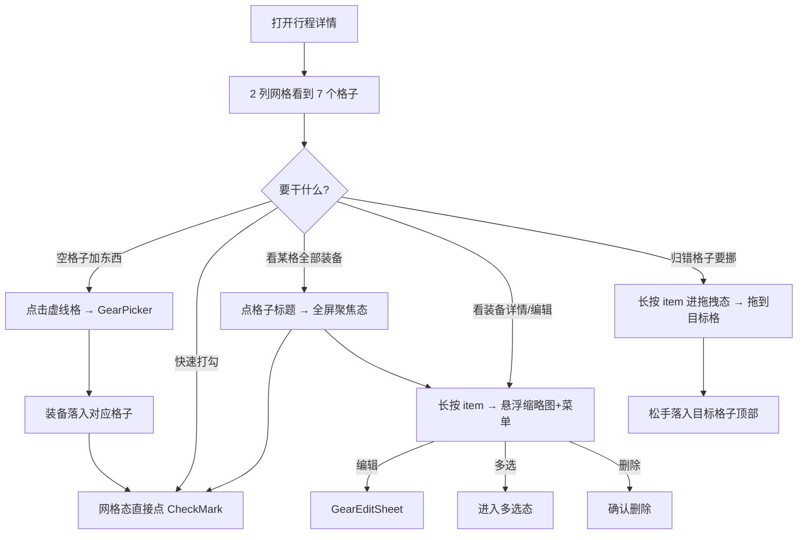

# 统一核查清单视图 · 设计 Spec（v0.7.0）

> 版本：v3 · 2026-06-22
> 状态：草稿（待审查）
> v3 修订（关键翻转）：根据《ArkUI 长按展开二级菜单 + 连续拖拽 最佳实践》纠正 v2 的核心技术误判。**v2 曾断言 ArkUI 做不到便单那种「长按浮起→不松手→连贯拖拽」，这个判断是错的**——用 `GestureGroup(GestureMode.Sequence, LongPressGesture + PanGesture)` 顺序手势完全可以一气呵成。因此 v3：长按看详情菜单与跨区拖拽流转合并为「一套连贯手势的两阶段」；采用自实现 LongPress+Pan 浮层（原 §3.6.1 被否决的「方案 C」翻案为 v2 首选）；连贯拖拽列为 v2 首版交付。
> v2 修订（保留生效部分）：基于华为「便单」四象限交互范式重写。布局 2 列网格（首屏 2×2.5 格子）；新增「点击格子全屏聚焦」；拖拽落点对齐目标格子顶部。（v2 曾错误主张“复用 bindContextMenu”+“拆两套手势”+“降级方案 A”，均被 v3 推翻）。
> 上位文档：`docs/vision/2026-06-04-product-vision-and-restructure.md`（纲领 §4 v3 修订）
> 技术底座：`docs/v2-foundation/specs/2026-06-09-service-archive-restructure-design.md`（§6 / §3.5）
> 手势范式来源：`ArkUI-LongPress-Drag-Menu-Guide.md`（长按+连续拖拽最佳实践指南，2026-06-11）——本文 §3.5/§4.5 的技术范式直接出自该指南（v3 已将原 §3.6 拖拽章节合并进 §3.5 连贯手势）。
> 被替代文档：原「塔科夫式配装系统」设计 spec（核心交互范式已废弃，文档已随 v3 范式推翻删除；数据模型已汲取进本 spec §3.5/§6）
>
> 本文档是 PackCheck「第二灵魂」——带格子的核查清单——在工程 + 交互 + UI 层的完整落地方案。
> 供外部 AI 审查用，包含完整背景、思路演进、UI 方案、交互方案、技术方案和实施路线。

---

## 0. 背景与思路转变

### 0.1 PackCheck 是什么

PackCheck 是一款鸿蒙原生装备管理 App（ArkTS + ArkUI，API 23+），面向户外玩家。产品名 = Pack（打包）+ Check（核查），核心解决的是：户外出行前装备品类杂数量多，容易漏带，需要一个工具提前列好、收拾行李时逐项打勾确认。

产品定义了两个灵魂：

- **灵魂一：服役档案**——装备与人真实经历的情感连接（已在 v0.6.0 地基层落地）
- **灵魂二：带格子的核查清单**——出行前科学打包不漏带（本文档的主题）

### 0.2 原方案：塔科夫式配装系统（v2，已废弃）

v0.6.0 地基层完成后，原本计划的第二步是一套复杂的「塔科夫式配装系统」：

- **两阶段流水线**：先在「功能视角」按身体部位 x 分层凑齐装备（选装阶段），再拖进各容器装包（装包阶段）
- **双 Tab 切换**：行程详情页内有「配装」和「清单」两个 Tab，分别对应不同视角
- **功能视角 vs 容器视角**：正交二分，一个看身体部位槽位，一个看背包/腰包等容器
- **容器即实例**：背包从「一件装备」升格为容器，内部可嵌套装备

（该方案原有一份完整设计 spec，已随 v3 范式推翻一并删除；其数据模型（`BodyZone`/`CATEGORY_SLOT_MAP`）价值部分已汲取进本 spec §3.5 与 §6。）

### 0.3 为什么推翻（第一性原理复盘）

实际开发落地后发现：

**核心矛盾：配装和清单操作的是同一份数据（`TripChecklist.items`），两个 Tab 呈现形式不同但功能完全重复。** 用户在「配装」Tab 里做的事（按部位分组看装备），在「清单」Tab 里也能做（按 group 分组看同样的装备 + 打勾）。找不到一个只能在配装界面做、而清单界面做不了的操作。

从第一性原理回到用户真实场景：

> 收拾行李前，我打开 App，看到我上次列好的物品清单，逐项确认每个东西是否已经放进包里，打一个勾。全部打完，出发。

这个场景里根本不存在「两个阶段」。用户不需要「先在一个视图里按功能凑齐」再「切到另一个视图打勾」。**往格子里添东西 + 打勾 = 全部动作。** 两阶段流水线是对「逃离塔科夫」游戏体验的过度借鉴，本质上是在一个工具 App 里制造了不必要的游戏化复杂度。

**结论：配装不是一个独立系统，它是清单的分组骨架。格子 = 骨架，打勾 = 能力，二者天然一体。**

### 0.4 新方向：格子即清单，一体不分家

一句话总结：**预设身体部位格子作为清单的分组骨架，用户在格子里填装备 + 出发前逐项打勾，一个统一界面完成全部。**

参考系：华为鸿蒙「便单」App 的四象限待办。通过逐帧拆解便单交互视频，提炼出四个被本方案直接采纳的范式：

1. **网格化的格子布局**——便单是 2×2 四象限网格，每个象限是一张独立彩色卡片，待办项常驻可见。本方案把四象限扩展为 2 列网格、7 个身体部位格子。
2. **点击格子标题 → 该格子放大铺满全屏**——便单点击象限标题后，该象限放大占满全屏（× 关闭 + 标题 + 全部待办列表）。本方案采纳为「全屏聚焦单格子」模式，解决「格子内装备多、首屏放不下」的密度问题。
3. **长按项 → 背景高斯模糊 + 选中项浮起 + iOS 式浮动菜单**——便单长按待办项后，背景变暗模糊、选中项浮起高亮、弹出完整菜单（多选/分享/移动/删除等）。本方案采纳为「长按 = 装备详情悬浮缩略图 + 浮动菜单（编辑/多选/删除）」。
4. **跨格子拖拽流转**——便单长按浮起后不松手继续拖，可把待办项拖到其他象限，松手落入目标象限顶部，原位留占位影子。本方案采纳为「拖拽跨区流转」，落点对齐为目标格子顶部。**关键：这第 3 、第 4 两个范式是同一根手指一气呵成的，ArkUI 同样能做到（见下方技术真相）。**

> **重要纠正：v2 的技术判断是错的（详见 §3.5+§3.6）**。v2 曾断言：“ArkUI 的 `bindContextMenu(LongPress)` 是松手才出菜单，无法连贯拖拽，所以长按看菜单与拖拽流转必须拆为两套手势”。【这个结论不成立】——问题不在 ArkUI，而在「用错了 API」。`bindContextMenu` 确实做不到连贯拖拽，但用 **自实现的 `GestureGroup(GestureMode.Sequence, LongPressGesture({ duration: 400 }) + PanGesture({ distance: 5 }))`**，就能复刻便单那种「手指始终不离屏：长按 400ms 出菜单/缩略图 → 不松手继续移动则 Pan 接管跳转拖拽 → 松手落位」的一气呵成。因此 v3 把长按与拖拽重新合并为一套连贯手势。代价：详情缩略图 + 菜单不再复用 GearPage 的 `bindContextMenu`，改为自绘浮层（条件渲染 + 绝对定位 Stack）。

### 0.5 被推翻的决策清单

| 原决策 | 推翻理由 |
|--------|----------|
| 两阶段流水线（选装然后装包） | 过度设计，用户不需要这种复杂时序 |
| 配装/清单拆成两个 Tab | 同一份数据两种皮肤，功能重复，制造困惑 |
| 功能视角 vs 容器视角正交二分 | 格子本身已融合功能和位置维度 |
| 容器即实例（背包升格为容器） | 降为远期能力，当前简化为「背负」格子 |
| （v2）复用 GearPage 的 `bindContextMenu` 做长按菜单 | `bindContextMenu` 出菜单后必须松手，做不到连贯拖拽。为了便单式一气呵成，v3 改为自实现 LongPress+Pan 浮层 |
| （v2）「长按看菜单」与「长按拖拽」拆为两套手势 | 技术误判。Sequence 顺序手势可把两者合为一次连贯手势的两阶段，v3 合并 |
| （v2）拖拽降级为方案 A（菜单内「移动到…」） | 连贯拖拽已被证明可行，v2 首版直接交付。方案 A 降为无障碍/快捷补充手段 |

### 0.6 保留的设计资产

| 资产 | 来源 | 本方案如何复用 |
|------|------|---------------|
| BodyZone 枚举（7 分区） | GearLoadout.ets | 格子的分区定义 |
| ~~LayerOrder 分层排序~~ | GearLoadout.ets | **一期取消（见下方 D-1 说明）**。枚举保留但标 `@deprecated`，不删除以向后兼容 |
| CATEGORY_SLOT_MAP 映射 | GearLoadout.ets | 装备自动归入格子 |
| Zone 颜色系统（7 色） | Colors.ets | 格子标题色条 |
| LoadoutService 纯函数 | LoadoutService.ets | groupByZone 等；~~sortItemsByLayer~~ 一期不再做分层排序（保留签名，内部不做重排，按 `items` 数组原始顺序返回——等价于恒等返回，因数组本身即添加顺序） |
| LoadoutProgressBar | 进度条组件 | 顶部全局进度 |
| LoadoutGearItem | 装备行组件 | 格子内 item 渲染 |
| GearPage 长按菜单的**视觉设计 + 回调签名** | GearPage.ets | 详情卡字段布局、菜单项文案/图标/红色删除、`onOpenEditGear`/`onEnterMultiSelect`/`onConfirmDelete` 回调 —— 这些可直接搬过来（看§0.6 说明） |
| **手势范式** | **ArkUI-LongPress-Drag-Menu-Guide.md** | **`GestureGroup(Sequence, LongPress+Pan)` 连贯手势 + 自绘浮层 + 动画时序 + 避坑清单，本文 §3.5/§4.5 直接采用该指南范式** |

> **D-1（审查采纳，v3.1）：一期取消「层级」概念（贴身→保暖→防风→隔绝）**。理由：用户添加装备时并无「选层级」动作，层级靠 `CATEGORY_SLOT_MAP` 从品类推导，映射不准则层级无意义；一期每 Zone 装备量少（2-4 件），分层排序收益低却给拖拽落点/渲染/badge 增加复杂度。处理：删 `LayerOrder` 排序依赖、衣物格子内不再显示层级 badge；`GearLoadout.ets` 枚举与 `LoadoutService.sortItemsByLayer` **保留签名但标 `@deprecated`**（向后兼容，旧数据不报错），`sortItemsByLayer` 改为恒等返回 / 按添加时间排序。后续积累实际使用数据后再决定是否加回。

> **关键复用说明（v3 校正）**：用户明确「长按显示装备详情悬浮缩略图 = 现有功能」。经核查，`GearPage.ets` 已用 ArkUI 原生 `bindContextMenu(this.GearContextMenu(item), ResponseType.LongPress, { preview: this.GearPreviewCard(item), ... })` 实现了「长按 → 模糊背景 + 悬浮详情卡 + 浮动菜单」，菜单项就是「编辑 / 多选 / 删除」。**但本清单视图不能直接复用这套 `bindContextMenu`**——因为要支持「长按后不松手连贯拖拽」，而 `bindContextMenu` 做不到。所以复用的是 GearPage 那套菜单/详情卡的**视觉设计与回调签名**（搬到自绘浮层里），而非 `bindContextMenu` 调用本身。两处手感仍保持一致（同样的详情卡 + 同样的编辑/多选/删除），只是清单这边多了一条「不松手拖走」的能力。未来可考虑把装备库也迁到自绘浮层统一。

---

## 1. 产品目标与成功标准

### 1.1 目标

让用户在行程详情页的**一个界面**内，完成「列装备」和「打勾核查」全部动作。没有 Tab 切换、没有阶段割裂、没有视角切换。

### 1.2 成功标准

- 打开行程详情即可看到所有格子（含空格子），一眼知道「我还没准备什么」
- 添加装备零认知负担——系统自动归入正确格子，用户只需在有歧义时手动调整
- 收拾行李时对着同一个界面逐项打勾，打完即核查完毕
- 装备归错格子时，长按拖动到正确格子，直觉、自然、不需要说明书
- 空格子本身就是提醒——「头部」空着会让你想起帽子、太阳镜
- 全程动效丝滑，符合 PackCheck 设计语言（Spring 曲线、按压反馈、错落入场）

---

## 2. UI 方案

本方案有两个层级的视图：**网格总览态**（默认，2 列网格看全部格子）和**全屏聚焦态**（点击格子标题进入，单格子铺满全屏看全部装备）。

### 2.1 网格总览态（默认）

#### 2.1.1 整体布局

2 列网格，**首屏精确展示 2×2.5 个格子**——即完整展示上方 4 个格子，再露出第 5、6 个格子顶部约 1/3，用「半个格子」从视觉上暗示「下方还有，可继续下滑」。这是用户明确指定的首屏密度。

```
+-------------------------------------+
| NavBar: <- 行程标题       ...        |  固定顶部
+-------------------------------------+
| SharedInfo: 2025-06-12 武功山 22km   |  摘要条
+-------------------------------------+
| ProgressBar: ========-- 12/18 (67%) |  全局进度（sticky 吸顶）
+-------------------------------------+
| +---- 头部 ----+  +---- 上身 ----+   |  第 1 行（完整）
| | 帽子    [v]  |  | 速干衣  [v]  |   |
| | 太阳镜  [ ]  |  | 抓绒    [v]  |   |
| | + 2 件…      |  | 冲锋衣  [ ]  |   |
| +-------------+  +-------------+   |
| +---- 下身 ----+  +---- 鞋 ------+   |  第 2 行（完整）
| | - -[+]- -   |  | 登山鞋  [ ]  |   |
| | （空态）     |  |             |   |
| +-------------+  +-------------+   |
| +---- 背负 ----+  +---- 睡眠 ----+   |  第 3 行（仅露顶 1/3）
| | 背包55L [v]  |  | 帐篷    [v]  |   |  ← 暗示可下滑
+--+-------------+--+-------------+---+
                              [+ FAB]
```

下滑后可见第 3 行（背负 / 睡眠）完整与第 4 行（杂项 / 占位）。

#### 2.1.2 网格规格

- **列数**：2 列，列间距 12vp，行间距 12vp，左右页边距 16vp
- **格子宽度**：`(屏宽 - 2×16 - 12) / 2`，自适应
- **首屏高度推导**：首屏可视高度（去掉 NavBar + SharedInfo + ProgressBar）内，让「2 行完整格子 + 第 3 行 1/3」恰好排布。格子统一高度需根据该约束反推（详见 §4 技术方案，用 `2.5 行 ≈ 可视高度` 反算单格高度），而非固定 vp 值——保证不同机型都呈现 2×2.5 的暗示效果。
- **格子内最多展示 N 行装备**（网格态是「缩略预览」，不是全量）：单格内最多显示前 3 件装备 + 「+N 件」折叠提示行；想看全部 → 点标题进全屏聚焦态。
- **F-5：「杂项」格子跨 2 列**。杂项（未归类/其他）条目数量不确定且常偏多，用半列宽容易拥挤；故杂项格用 `GridItem` 的 `.columnSpan(2)` 横跨整行（或 `GridCol` span），占满宽度。实现上需保证杂项格始终排在网格序列末尾（避免跨列格夹在中间打乱双列节奏）。

#### 2.1.3 格子两态设计（网格态）

**空态格子**（整格虚线）：
- 标题行：Zone 主题色条 4vp×20vp + 图标 + 名称
- 内容区：虚线边框（`BorderStyle.Dashed`，`DIVIDER_COLOR`，1.5px），居中「+」图标（`sys.symbol.plus`，20vp，`TEXT_TERTIARY`）
- **F-4：空态虚线占位区与同行有内容格子等高**。同一行两格高度联动（见 §3.4 过渡要点），空格不能因「没内容」而变矮、亦不能拉满后留下一大块死白。虚线占位区撑满整格高度，内部「+」图标在**虚线区内垂直 + 水平居中**（`justifyContent: FlexAlign.Center` + `alignItems`），使空态与有内容格视觉重心一致、画面均衡。
- 整格圆角 `CARD_RADIUS`（16vp），背景轻量（透明或极淡 Zone 色）
- 点击整格触发添加，预选当前 Zone 对应品类

**有内容格子**：
- 标题行（**可点击区，点击进全屏聚焦**）：Zone 色条 + 图标 + 名称 + 右侧数量（`TEXT_TERTIARY`）
- 内容区：白色卡片（`CARD_BG`），圆角 16vp，微阴影 `SHADOW_SUBTLE`
- Item 行：紧凑高度（约 40vp），左 CheckMark（圆形 24vp）+ 装备名（单行省略）
- 超过 3 件：第 4 行显示「+N 件」灰字提示，点击进全屏聚焦
- 底部不放「+」行（网格态空间紧张），添加统一走空态点击 / FAB / 全屏聚焦内

### 2.2 全屏聚焦态（点击格子标题进入，核心）

参考便单「点击象限标题 → 该象限放大铺满全屏」。这是用户强调「一定要、很关键」的能力。

#### 2.2.1 布局

```
+-------------------------------------+
| [×]   头部                  3/5     |  顶部：关闭 + Zone 名 + 该区进度
+-------------------------------------+
| ●  帽子                       [v]   |  全部装备纵向列表
| ○  太阳镜                     [ ]   |  （不再折叠，全量展示）
| ●  头巾                       [v]   |
| ●  魔术头巾                   [v]   |
| ○  雪套                       [ ]   |
|                                     |
| - - - - - - [+ 添加到头部] - - - - -|  底部虚线添加行
+-------------------------------------+
```

- **入场动效**：被点击的格子用 `geometryTransition`（共享元素）从网格位置放大铺满全屏，背景其余格子下沉模糊。
- **顶栏**：左 `×` 关闭（回网格态，共享元素缩回原位）+ 居中 Zone 名 + 右侧该 Zone 进度（已勾/总数）+ **「逐项核查本区」入口**（D-2：携带当前 Zone 进入 Review，只核查本区，退出回本聚焦态）。
- **列表**：该 Zone 全部装备，单行高度 52vp，左 CheckMark（28vp）+ 名称。可纵向滚动。（D-1：一期取消层级 badge，列表按添加顺序 / 原始顺序平铺）
- **底部**：虚线「+ 添加到{Zone}」行，预选该 Zone 品类。
- **此模式下的长按**（F-2 修订）：复用 §3.5 的自绘浮层组件 `GearItemContextMenu`（详情悬浮缩略图 + 编辑/多选/删除菜单）。但聚焦态只有单 Zone、跨格拖拽无意义，故 item 行以「**仅菜单模式**」加载该组件——只绑 `LongPressGesture` 触发浮层，**不绑 `PanGesture`**，不做跨格落点判定。
- **此模式下的拖拽**：聚焦态是单格子，跨格拖拽无意义；拖拽流转只在网格总览态生效（详见 §3.5）。

#### 2.2.2 退出

- 点 `×` / 系统返回手势 → 共享元素缩回原格子位置，背景格子恢复，回到网格总览态。

### 2.3 颜色系统

沿用现有 Zone 颜色（`Colors.ets`）：

| Zone | 颜色 Token | 用途 |
|------|-----------|------|
| 头部 | `ZONE_HEAD_COLOR` | 标题色、色条 |
| 上身 | `ZONE_UPPER_COLOR` | 同上 |
| 下身 | `ZONE_LOWER_COLOR` | 同上 |
| 鞋 | `ZONE_FEET_COLOR` | 同上 |
| 背负 | `ZONE_CARRY_COLOR` | 同上 |
| 睡眠 | `ZONE_SLEEP_COLOR` | 同上 |
| 杂项 | `ZONE_MISC_COLOR` | 同上 |

格子之间的色彩对比让用户一眼识别归属，类似华为四象限的彩色卡片方案——2 列网格下，相邻格子的不同 Zone 色让边界更清晰。

### 2.4 信息密度控制

- 网格态每格最多预览 3 件 + 折叠提示，保证格子高度可控、首屏精确呈现 2×2.5。
- 想看某格全部装备 → 点标题进全屏聚焦态，纵向无限滚动。
- 空格子与有内容格子等高（同一网格行需对齐），空态用虚线 + 加号填充。
- 进度条 sticky 吸顶，始终可见。
- 底部安全区 100vp（避免被 FAB 遮挡最后一行格子）。

---

## 3. 交互方案

### 3.1 核心交互流



### 3.2 添加装备

**入口（交互入口原则：长在已有行为里）**：

1. **网格态空格子点击**：整个虚线格可点击，弹出 GearPicker，预筛当前 Zone 对应的品类
2. **全屏聚焦态底部「+ 添加到{Zone}」行**：同上，预选当前聚焦的 Zone
3. **FAB 浮动按钮**：不预选品类，全品类选择

**GearPicker 行为**：
- 从装备库导入（按品类筛选，当 Zone 有预选时自动选中对应 tab）
- 手动快速添加（输入名称即创建临时 item，不要求关联装备库）
- 选中后 item 自动出现在触发 Zone 的格子内（`group` 字段写入 Zone 枚举值）

### 3.3 打勾核查

- 点击 item 左侧 CheckMark，切换 `checked` 状态（网格态、全屏聚焦态均可打勾）
- 勾选时视觉反馈：CheckMark 弹跳（scale 0.8 -> 1.1 -> 1.0，`SPRING_PRESS` 曲线）
- 已勾选 item：文字变灰（`PLACEHOLDER_COLOR`）+ 实心绿勾（对齐便单 f_034 帧的已勾态）
- 顶部 ProgressBar 实时更新
- 全部打完（100%）时触发轻量庆祝动效（进度条短暂闪绿 + 微振动反馈）

### 3.4 点击格子标题 → 全屏聚焦（用户强调「一定要、很关键」）

参考便单点击象限标题放大铺满全屏。

**触发**：点击网格态中任一**有内容格子的标题行**（空格子标题点击仍走添加）。

**过程**：
- 被点格子用 `geometryTransition`（共享元素）从网格原位放大铺满全屏。
- 背景其余格子下沉 + 高斯模糊淡出。
- 顶部出现 `×` 关闭 + Zone 名 + 该区进度，下方全量展示该 Zone 装备列表（不折叠）。

**退出**：点 `×` / 系统返回 → 共享元素 Spring 缩回原格子位置，背景恢复。

> 实现要点：`geometryTransition` + 进场 `animateTo({ curve: SPRING_HERO_EXPAND() }, () => { this.focusedZone = zone })`、退场 `animateTo({ curve: SPRING_HERO_COLLAPSE() }, () => { this.focusedZone = null })`，进退场对称。详见 §4.5。
>
> （Issue 2：复用 `AnimationTokens.ets` 已有的共享元素转场 token —— `SPRING_HERO_EXPAND`（0.42/0.73，展开）与 `SPRING_HERO_COLLAPSE`（0.36/0.78，收回），不新增 token，进/退语义更精确。）

### 3.5 长按 item —— 一套连贯手势的两阶段（详情/菜单 → 不松手直接拖）

> **v3 核心翻转**：本节合并 v2 的「§3.5 长按看菜单」+「§3.6 长按拖拽」两套手势。技术真相（见 §0.4）是——用 `GestureGroup(GestureMode.Sequence, LongPressGesture + PanGesture)` 顺序手势，可以把「长按浮起出菜单/详情」与「不松手继续拖跨区流转」合成**同一次按压的两个阶段**，正是便单一气呵成的手感。手势范式来源：`ArkUI-LongPress-Drag-Menu-Guide.md`。

用户明确：「长按显示装备详情的悬浮缩略图（现有功能），菜单里有编辑、多选、删除按钮」，且对齐便单「按住直接甩过去」的连贯拖拽。本视图用**自实现 LongPress+Pan 浮层**统一承载这两件事。

#### 3.5.1 阶段 1：长按 ≥400ms → 浮起出菜单/详情缩略图

**触发**：长按 item 行 ≥400ms（`LongPressGesture({ repeat: false, duration: 400 })`，400ms 对齐 iOS HIG）。

**呈现（对齐便单 f_012 帧，全部自绘浮层）**：
- 背景高斯模糊变暗（自绘蒙层 Stack，非 `bindContextMenu` 系统蒙层）。
- 触发瞬间 vibrator 轻触觉反馈，被长按 item 浮起。
- 上方/下方显示**装备详情悬浮缩略图**（**复用 `GearPage` 现有视觉设计与字段**：分组、重量、价格、出行次数、备注、添加日期，搬进自绘浮层渲染）。
- 弹出**浮动菜单**（复用 `GearPage` 菜单项的**回调签名**），三个菜单项：
  - **编辑** → `onOpenEditGear(item)`，打开装备编辑表单
  - **多选** → `onEnterMultiSelect(item.id)`，进入多选态（可批量打勾/移动/删除）
  - **删除**（红色 `DANGER_COLOR`，`destructive: true`） → `onConfirmDelete(item)`，二次确认后移除

> 为什么不直接复用 `GearPage` 的 `bindContextMenu`：`bindContextMenu` 出菜单后手指必须**离屏**，无法用同一次按压继续拖；且系统浮层样式定制受限。v3 改为自实现，复用其**视觉设计 + 回调签名**而非整套 API。详见 §4.5。

#### 3.5.2 阶段 2：不松手继续移动 → Pan 接管，进入跨区拖拽流转

参考便单跨象限拖拽（落点对齐为**目标格子顶部**，与便单 f_018 帧一致）。

**触发**：阶段 1 浮起后，手指**不松开**继续移动超过阈值（`PanGesture({ fingers: 1, direction: PanDirection.All, distance: 5 })`，5~8vp 防误触）→ Sequence 手势自然把控制权交给 PanGesture，菜单/详情卡淡出，进入拖拽态。

**拖拽中**：
- 被拖 item 变跟手白色胶囊（对齐便单 f_011/f_013 帧），菜单/详情卡消失。
- 浮层 `translate(dragOffsetX, dragOffsetY)` 实时跟手（`onActionUpdate`，不在回调内做耗时操作）。
- 原位留半透明占位「影子」。
- 经过其他 Zone 格子时，目标格高亮：边框加深 + scale 1.02 + 顶部显示「落点指示」横线。

**松手放置**（`onActionEnd` 判落点热区）：
- 落入目标 Zone，item `group` 更新为新 Zone。
- **落点 = 目标格子顶部**（便单 f_018：背包拖进后落在帽子上面）。新 item `unshift` 到目标格顶部，Spring 归位。因 D-1 已取消层级，格子内为平级列表，不再按层级归位。
- 原格子该 item 消失（若变空 → 过渡为空态虚线格）。
- 目标格若原为空态 → 虚线消失，展开为有内容态。

**取消**：拖回原位 / 松手在非格子区域 → Spring 弹回原位。

> **关键时序坑**：松手后必须等回弹/淡出动画**播完再 resetState**（用 `setTimeout` 延迟清空浮层状态），否则浮层会闪烁突变。详见 §4.5 与避坑清单。

> **F-1 决策注记（审查 v3.1）**：审查曾建议拖拽落点改为「追加到末尾 push」（理由是取消层级后顶部插入会破坏排序）。作者拍板：**维持顶部 `unshift`**。原因——层级已取消（D-1），格子内为平级列表，担心的「破坏排序」不复存在；且顶部落点更对齐便单 f_018 原始帧，「刚拖过去的东西浮到最显眼的顶部」也符合直觉。此为有意决策，非漏改。

#### 3.5.3 三方案取舍（v3 翻案记录，需审查重点关注）

| 方案 | 做法 | v3 结论 |
|------|------|------|
| **C. 自实现 LongPress+Pan 组合手势（Sequence）** | 自绘浮层，长按出菜单/详情、不松手 Pan 接管拖拽，一次按压两阶段 | **✅ v2 首版选型**。指南证明可行，是便单连贯手感的唯一正解，动效控制力最强 |
| A. 菜单内「移动到…」/ 多选批量移动 | 长按出菜单，挪格走菜单项或多选 | 🔵 保留为**无障碍/快捷补充**：精确选目标、批量移动、不便长拖时用 |
| B. 系统 `onDragStart` + `bindContextMenu` 双绑 | 拖拽走系统能力、菜单走系统 API，靠时长/阈值区分 | ❌ 弃用。两者都靠长按、调参有坑，且 `bindContextMenu` 仍做不到不松手连贯拖 |

> **这是对 v2「优先方案 A、否决方案 C」的彻底翻案。** v2 误判 ArkUI 长按手势独占性与 Scroll 冲突不可解；指南证明 `GestureMode.Sequence` + 透明 `Image('')` 手势层 + `HitTestMode.Block` 即可干净解决。方案 C 复活为 v2 首版选型，方案 A 降为补充手段。

### 3.7 格子的空↔有内容过渡

**空变有内容（添加第一个 item）**：虚线格淡出 → 卡片背景淡入 + 高度展开 → 新 item translateY(12)+opacity(0) 滑入。

**有内容变空（删除最后一个 item）**：卡片内容淡出 → 高度收缩 → 虚线格淡入。

所有过渡使用 `SPRING_GENERAL`（response 0.35, dampingFraction 0.8）。网格态下同一行两格需保持等高，过渡时整行高度联动。

### 3.8 逐项核查模式（保留现有能力）

更多菜单 -> 「逐项核查」 -> 进入全屏 Review 模式（已有 `onOpenReview` callback），一次看一个 item 确认。适合最终出发前的严格核查。

> **D-2：两种全屏模式是「递进关系」，不是平行的两个入口。** 全屏聚焦态（§2.2，看某一格全部装备、批量浏览/打勾）是**轻量浏览**；逐项核查 Review（本节，一次翻一张牌、强制逐个确认）是**严格核查**。用户的自然路径是：在网格态点某格标题进聚焦态浏览本区 → 若想严格逐件确认，再从聚焦态升级进 Review。因此：
> - **聚焦态顶栏右侧新增「逐项核查本区」入口**（图标按钮 / 文字按钮），点击携带当前 Zone 进入 Review，只核查本区 item（而非全清单）。
> - Review 退出时回到来时的聚焦态（保持来路对称），而非直接回网格态。
> - 全局「逐项核查全部」仍保留在更多菜单（核查全清单）。
>
> **实现要点（Issue 4）**：现有 `onOpenReview` callback 签名是 `() => void`，不带参数，只能核查全清单。要实现「只核查本区」，二选一：① Index.ets 侧新增 `onOpenZoneReview(zone: string)` callback，逻辑为过滤 `trip.items` 仅保留 `group === zone` 的 item 后进入 Review；② 或复用现有 `onOpenReview`，在 UnifiedChecklistView 调用前先过滤 items 再传入。推荐①，语义更清晰、不侵入全局核查入口。
> 两者的关系：聚焦态 = 看本区，Review = 逐件确认；聚焦态是 Review 的上游浏览层，Review 是聚焦态的下游核查层。

### 3.9 手势冲突处理

- **网格 Scroll vs 长按**：自实现 `LongPressGesture({ duration: 400 })` 需手指基本不动满 400ms 才触发，与 Scroll 纵向快速滑动天然分流；item 上绑透明 `Image('')` 手势层 + `HitTestMode.Block`，避免子元素抢事件。
- **点击标题（全屏聚焦） vs 长按 item**：点击在标题行，长按在 item 行，区域不重叠。
- **阶段 2 Pan 拖拽 vs Scroll**：靠 Sequence 手势链路区分——只有先满足 400ms 长按、再移动超阈值（distance 5），PanGesture 才接管；普通纵向滑动不触长按，直接走 Scroll。拖拽态进行时锁 Scroll（`nestedScroll` / 拖拽期间禁用外层滚动）。
- **CheckMark 点击 vs 长按 item**：CheckMark 是独立小热区点击，item 其余区域长按，互不干扰。

---

## 4. 技术方案

### 4.1 新组件架构

```
TripDetailPage.ets (精简，删 SegmentButton)
+-- buildNavBar()
+-- buildSharedInfo()
+-- UnifiedChecklistView (新组件，替代 LoadoutView + ChecklistDetail)
    +-- ProgressBar (复用 LoadoutProgressBar，sticky)
    +-- // F-3：网格态与聚焦态都常驻树中，靠 visibility 切换，禁用 if/else 销毁源视图
    +-- 网格总览态  (visibility: focusedZone == null ? Visible : Hidden)
    |   +-- Scroll
    |   |   +-- Grid (2 列) / 或 Column 套 Row 手动 2 列
    |   |       +-- ForEach(ALL_7_ZONES)
    |   |           +-- ZoneGridCell (有内容) -> 标题(点击进聚焦) + 前 3 件预览 + CheckMark
    |   |           +-- EmptyZoneCell (空态) -> 虚线 + 加号
    |   +-- FAB
    +-- 全屏聚焦态  (visibility: focusedZone != null ? Visible : Hidden)
        +-- FocusedZoneView (× + Zone 名 + 进度 + 全量列表 + 底部添加行)
            +-- 共享元素 geometryTransition(zoneId)   // 网格态源视图不销毁，配对端始终存在

> 注：网格态与聚焦态均常驻组件树（visibility 切换而非 if/else），是 §4.5.6 F-3 要求——共享元素 `geometryTransition` 需要源/目标两端同时存在才能完成配对动画，销毁任一端会退化为生硬切换/闪烁。仅根 Stack 顶层的 DragOverlay 浮层可用条件渲染（它无共享元素配对需求）。

每个 item 行（网格态 & 聚焦态共用）:
  // Issue 5：手势层先声明（z-order 底层），内容行后声明（z-order 顶层），
  // 保证 CheckMark 的 onClick 不被 HitTestMode.Block 拦截
  Stack {
    Image('').hitTestBehavior(Block)               // ① 透明手势层（底层，只收长按/拖拽）
      .gesture(GestureGroup(Sequence, LongPress(400) + Pan(distance 5)))
    Row { CheckMark + 名称 ... }                   // ② 内容行（顶层，CheckMark 点击正常触发）
  }                                                 // 自实现连贯手势，详见 §4.5

根 Stack 顶层（条件渲染）:
  if (overlayItem != null) DragOverlay {           // 自绘浮层（蒙层+详情缩略图+菜单），无共享元素，可条件渲染
    GearPreviewFloating + (phase==='menu' ? GearItemContextMenu : 跟手白胶囊)
  }
```

### 4.2 组件职责

| 组件 | 文件 | 职责 |
|------|------|------|
| `UnifiedChecklistView` | `components/gear/UnifiedChecklistView.ets` | 新建。统一视图容器：进度条 + 网格态/聚焦态切换 + FAB + 共享元素管理 |
| `ZoneGridCell` | `components/gear/ZoneGridCell.ets` | 新建。网格态单格（有内容）：可点击标题进聚焦 + 前 3 件预览 + 「+N 件」折叠 + 每行 item 叠透明手势层（Sequence: LongPress+Pan） |
| `EmptyZoneCell` | `components/gear/ZoneGridCell.ets` | 新建（同文件）。网格态空态格：虚线 + 加号，点击触发添加 |
| `FocusedZoneView` | `components/gear/FocusedZoneView.ets` | **新建（v2 核心）**。全屏聚焦单格子：× 关闭 + Zone 名 + 进度 + 全量装备列表 + 底部添加行；用 geometryTransition 与网格格子做共享元素 |
| `DragOverlayManager` | `components/gear/DragOverlayManager.ets` | **新建（v3 复活）**。自绘长按拖拽浮层：背景蒙层 + 跟手详情缩略图 + 落点命中判定 + 归位动画。收敛浮层状态（overlayItem/phase/offset）与时序（resetState 延迟） |
| `GearPreviewFloating` / `GearItemContextMenu` | 新建 `components/gear/GearItemContextMenu.ets`（视觉复用 `GearPage`） | 自绘悬浮详情卡 + 编辑/多选/删除菜单。**复用 GearPage 视觉设计 + 字段，渲染在自绘浮层内**（不用 bindContextMenu）。回调参数注入 |
| `TripDetailPage` | `components/gear/TripDetailPage.ets` | 改造。删除 SegmentButton、删除双视图条件渲染 |

> **v3 校正**：长按交互不再复用 `GearPage` 的 `bindContextMenu` 整套 API（其出菜单后必须松手，做不到不松手连贯拖）。改为新建 `GearItemContextMenu.ets`，**复用 GearPage 的视觉设计与详情字段**，但渲染在自绘浮层、由 `DragOverlayManager` 统一驱动手势与动画。回调通过参数注入（onEdit / onMultiSelect / onDelete），由各调用方决定具体行为。

> **F-2：`GearItemContextMenu` 支持两种手势配置模式**（由调用方通过 prop 选择）：
> - **完整模式（`mode: 'full'`）**：绑 `GestureGroup(Sequence, LongPress(400) + Pan(distance 5))`，长按出菜单/详情 → 不松手 Pan 接管跨格拖拽流转。**网格总览态用此模式**（需要跨 Zone 拖拽）。
> - **仅菜单模式（`mode: 'menu-only'`）**：只绑 `LongPressGesture(400)` 触发浮层，**不绑 `PanGesture`**、不做跨格落点判定，松手即回弹。**全屏聚焦态用此模式**（单 Zone 内跨格拖拽无意义，见 §2.2.1）。
> 两种模式共用同一套自绘浮层视觉（详情卡 + 编辑/多选/删除菜单），仅手势绑定与落点判定逻辑不同，保证两处长按手感一致。

### 4.3 数据流

```
Index.ets (@State checklists/gears)
  -> TripDetailPage (@Prop)
    -> UnifiedChecklistView (@Prop trip, gears, callbacks)
      -> 内部调用 LoadoutService.groupByZoneAll(trip.items)
         得到 Map<Zone, items[]>（7 个 key 始终存在）
      -> ForEach 全部 7 Zone:
         有 items -> 渲染 ZoneCard
         无 items -> 渲染 EmptyZoneSlot
      -> 打勾: onToggleChecklistItem(itemId) -> 回调上层更新
      -> 拖拽: onMoveItemToZone(itemId, newZone) -> 回调上层更新 item.group
      -> 添加: onOpenGearPicker(preSelectedZone?) -> 回调上层弹 Sheet
```

### 4.4 关键数据变更

**新增 callback**：
```typescript
// Index.ets 需新增的 handler
onMoveItemToZone: (itemId: string, targetZone: string) => void
```

逻辑：在 `checklists` 中找到对应 item，将其 `group` 字段更新为 `targetZone`（BodyZone 枚举值）。**落点对齐目标格顶部（维持 unshift，见 F-1 决策注记）**：更新 group 后，把该 item 在 `items` 数组中移动到目标 Zone 同组元素的最前面（或在渲染层 `groupByZoneAll` 后对刚移入的 item 做 `unshift`），保证它显示在目标格子顶部而非末尾（对齐 §3.5.2 / 便单 f_018）。D-1 取消层级后不需按层级插入，直接 unshift 到顶部即可。

**LoadoutService 改造**：
```typescript
// groupByZone 改为始终返回全部 7 Zone（含空数组）
export function groupByZoneAll(
  items: ChecklistItem[]
): Map<string, ChecklistItem[]> {
  const map = new Map<string, ChecklistItem[]>();
  const zoneOrder: string[] = [
    BodyZone.Head, BodyZone.UpperBody, BodyZone.LowerBody,
    BodyZone.Feet, BodyZone.Carry, BodyZone.Sleep, BodyZone.Misc
  ];
  for (const zone of zoneOrder) {
    const zoneItems = items.filter(
      (item) => inferZoneFromGroup(item.group) === zone
    );
    map.set(zone, zoneItems);
  }
  return map;
}
```

### 4.5 长按交互 & 全屏聚焦 & 拖拽 实现方案

> 本节为 v3 重写，手势范式严格对齐 `ArkUI-LongPress-Drag-Menu-Guide.md`。核心是用**一套 `GestureGroup(GestureMode.Sequence, LongPressGesture + PanGesture)` 自实现浮层**承载「长按出菜单/详情 → 不松手 Pan 接管拖拽」两阶段，复刻便单连贯手感。

#### 4.5.1 连贯手势骨架（Sequence：长按 → Pan 两阶段）

item 行不绑 `bindContextMenu`，改为叠一层透明 `Image('')` 手势层并绑顺序手势：

```typescript
// 浮层状态（建议收敛到 DragOverlayManager 或本组件 @State）
@State private overlayItem: ChecklistItem | null = null  // 当前浮起的 item，null = 无浮层
@State private overlayPhase: 'menu' | 'dragging' = 'menu' // 阶段
@State private dragOffsetX: number = 0
@State private dragOffsetY: number = 0

// item 行：手势层在下（先声明 = z-order 底层），内容行在上（后声明 = z-order 顶层）
// Issue 5：Stack 子元素按声明顺序从底到顶排列。手势层若放在 Row 之上会用
// HitTestMode.Block 拦掉 CheckMark 的 onClick；放在下层则 CheckMark 点击先命中、
// 只有它不处理的长按/拖拽才穿透到下层手势层，符合 §3.9「CheckMark 点击与 item 长按互不干扰」
Stack() {
  // ① 透明手势层（底层，只接收长按/拖拽，不拦截上层 CheckMark 点击）
  Image('')
    .width('100%').height('100%')
    .hitTestBehavior(HitTestMode.Block)
    .gesture(
      GestureGroup(
        GestureMode.Sequence,             // 关键：顺序手势，不是 Parallel
        LongPressGesture({ repeat: false, duration: 400 })   // 阶段 1：400ms
          .onAction(() => {
            this.triggerHaptic()                  // vibrator 轻触觉
            this.overlayItem = item
            this.overlayPhase = 'menu'
            this.getUIContext().animateTo({ curve: SHARP_SNAP, duration: 180 }, () => { // D-3: SHARP_SNAP = Curve.Sharp
              // 浮层 + 菜单/详情缩略图 弹出（自绘，见 4.5.4）
            })
          }),
        PanGesture({ fingers: 1, direction: PanDirection.All, distance: 5 }) // 阶段 2
          .onActionStart(() => { this.overlayPhase = 'dragging' })  // 菜单/详情卡淡出
          .onActionUpdate((e: GestureEvent) => {
            this.dragOffsetX = e.offsetX   // 仅更新偏移，不做耗时操作
            this.dragOffsetY = e.offsetY
            this.updateDropTarget(e)       // 轻量：算当前悬停的目标格
          })
          .onActionEnd(() => { this.handleDrop() })  // 判落点 → 4.5.3
      )
    )

  // ② 内容行（顶层，CheckMark 的 onClick 正常触发，不被下层 Block 拦截）
  Row() { CheckMark({ ... }); Text(item.name) }
}
```

要点：① `GestureMode.Sequence` 保证「先长按满 400ms，再移动」才进拖拽，普通滑动直接漏给 Scroll；② 透明 `Image('')` + `HitTestMode.Block` 是指南验证的稳妥写法，避免内部可点击子元素拦截手势；③ `onActionUpdate` 内只更新偏移量，重活（重排数据）留到 `onActionEnd`。

#### 4.5.2 自绘浮层：详情缩略图 + 菜单（复用 GearPage 视觉，不用 bindContextMenu）

浮层用**条件渲染 + 绝对定位 Stack** 盖在最上层，整套自绘：

```typescript
// UnifiedChecklistView 根 Stack 顶层
if (this.overlayItem != null) {
  Stack() {
    // ① 背景蒙层：自绘高斯模糊 + 变暗，点击空白处取消
    Column().width('100%').height('100%')
      .backgroundColor('rgba(0,0,0,0.32)')
      .backdropBlur(20)
      .onClick(() => this.dismissOverlay())

    // ② 浮起的 item 缩略图（跟手）
    GearPreviewFloating({ item: this.overlayItem })   // 复用 GearPage 详情卡视觉/字段
      .translate({ x: this.dragOffsetX, y: this.dragOffsetY })

    // ③ 菜单：仅 phase==='menu' 时显示，进入 dragging 即淡出
    if (this.overlayPhase === 'menu') {
      GearItemContextMenu({
        items: [
          { icon: $r('...'), label: '编辑',  action: () => this.onOpenEditGear(this.overlayItem!) },
          { icon: $r('...'), label: '多选',  action: () => this.onEnterMultiSelect(this.overlayItem!.id) },
          { icon: $r('...'), label: '删除',  action: () => this.onConfirmDelete(this.overlayItem!), destructive: true },
        ]
      })
    }
  }
  .transition(TransitionEffect.OPACITY.animation({ curve: SHARP_SNAP, duration: 180 }))  // D-3: token
}
```

`ContextMenuItem` 接口（指南范式，供 `GearItemContextMenu` 消费）：`{ icon: Resource; label: string; action: () => void; disabled?: boolean; destructive?: boolean }`。菜单**视觉与字段复用 `GearPage`**，但渲染在自绘浮层内、回调由参数注入。

#### 4.5.3 落点判定与归位（onActionEnd）

```typescript
private handleDrop(): void {
  const target = this.hitTestZone(this.dragOffsetX, this.dragOffsetY)  // 命中哪个 Zone 格
  if (target != null && target !== this.overlayItem!.group) {
    this.onMoveItemToZone(this.overlayItem!.id, target)  // 落点=目标格顶部(unshift, 见 §4.4 / F-1 决策)。D-1 取消层级，平级列表直接置顶
  }
  // 回弹/落位动画
  this.getUIContext().animateTo({ curve: SPRING_GENERAL(), onFinish: () => {
    this.resetOverlayState()          // 关键：动画播完再清状态，避免闪烁
  }}, () => {
    this.dragOffsetX = 0
    this.dragOffsetY = 0
  })
}

private resetOverlayState(): void {     // 用 onFinish / setTimeout 延迟调用
  this.overlayItem = null
  this.overlayPhase = 'menu'
  this.dragOffsetX = 0
  this.dragOffsetY = 0
}
```

落点 = 目标格顶部由 §4.4 `onMoveItemToZone` 的 `unshift` 保证。拖到非格子区 / 拖回原位 → `target` 为空，仅 Spring 回弹。

#### 4.5.4 动画时序（显式 animateTo，不靠隐式）

- 浮层 + 菜单**弹出**：`SHARP_SNAP`（= Curve.Sharp，见 D-3），180ms，伴随 item scale 1→1.04。
- 进入拖拽：菜单 `EASE_FADE`（= Curve.EaseOut）淡出 120ms，详情缩略图收成跟手白胶囊。
- 松手归位 / 落位：`SPRING_GENERAL`（response 0.35, dampingFraction 0.8）。
- 浮层**消失**：`EASE_FADE`（= Curve.EaseOut），150ms，在 `onFinish`/`setTimeout` 后 `resetOverlayState`。

#### 4.5.5 避坑清单（来自指南第 6/9 节，实现必检）

- **必须用 `GestureMode.Sequence`，不要用 `Parallel`**：Parallel 会让长按和 Pan 同时争用，手感错乱。
- **手势层用透明 `Image('')` + `HitTestMode.Block`**：否则 CheckMark / 文本等子元素会拦截触摸，长按/拖拽时灵时不灵。
- **`onActionUpdate` 内不做耗时操作**：只更新 offset / 轻量命中判定，重排数据放 `onActionEnd`，否则拖拽掉帧。
- **动画播完再 `resetState`**：用 `animateTo` 的 `onFinish` 或 `setTimeout` 延迟清空浮层状态，提前清会导致浮层闪烁突变。
- **别忘了拖拽期锁外层 Scroll**：进入 dragging 阶段禁用 `Scroll`（`nestedScroll` 或 enabled），避免边拖边滚。
- **触觉反馈**：长按触发瞬间调用 vibrator（轻档），强化「抓起」实感。

> **真机调参点（实现时标 `// TODO: 真机调参`，参数仅为建议初值）**：① `LongPressGesture.duration` 初值 400ms，真机试 350/400/450 找既不误触也不迟钝的点；② `PanGesture.distance` 初值 5vp，Sequence 下长按已成功、手指已静止，5vp 可能偏大，试 2–3vp；③ 浮层弹出 `SHARP_SNAP` 时长 180ms，试 150/180/200，太快像闪现、太慢像卡顿；④ 网格入场 stagger 间隔 40ms（7 格 ≈ 280ms 总入场），真机看是否拖沓。

#### 4.5.6 点击格子标题 → 全屏聚焦（geometryTransition 共享元素）

```typescript
@State private focusedZone: string | null = null  // null = 网格态

// 网格态格子标题 onClick（进场：放大铺满）
.onClick(() => {
this.getUIContext().animateTo({ curve: SPRING_HERO_EXPAND() }, () => {
this.focusedZone = zone
})
})

// 网格格子 与 FocusedZoneView 容器 共享同一 geometryTransition id
.geometryTransition('zone_' + zone)

// 关闭（退场：缩回原位）
.onClick(() => {
this.getUIContext().animateTo({ curve: SPRING_HERO_COLLAPSE() }, () => {
this.focusedZone = null
})
})
```

要点：网格格子与全屏容器用相同 `geometryTransition('zone_xxx')` id，配合 `animateTo` 包裹状态切换，系统自动做放大/缩回的共享元素过渡。这是 ArkUI 原生能力，无需手算坐标。

> **F-3 实现注意（防转场降级）**：切换 `focusedZone` 时**不要用 `if (focusedZone) FocusedZoneView() else Grid()` 这种 if/else 销毁网格态源视图**——源视图被销毁后共享元素失去配对端，geometryTransition 会退化为生硬切换/闪烁。正确做法：网格态格子始终保留在节点树中，用 `.visibility(this.focusedZone == zone ? Visibility.Hidden : Visibility.Visible)` 控制可见性；全屏容器用 `.position`/绝对定位叠加在网格之上。两端节点全程存在，仅靠可见性与位移过渡，确保共享元素始终有对端。详见 §6 风险表 F-3。

> 跨格拖拽实现并入 §4.5.1~§4.5.5（自实现 Sequence 手势浮层）。落点到顶部由 §4.4 `onMoveItemToZone` 的 `unshift` 保证。方案 A（菜单「移动到…」/ 多选批量移动）作为无障碍补充并行存在，复用同一 `onMoveItemToZone` 回调。

### 4.6 动效规格表

| 场景 | 曲线 | 参数 | 细节 |
|------|------|------|------|
| 格子入场（stagger） | SPRING_GENERAL | delay: staggerDelay(index) | translateY(12->0) + opacity(0->1) |
| 空变有内容展开 | SPRING_GENERAL | response 0.35 | 虚线框淡出，卡片淡入 + height 展开 |
| 有内容变空收缩 | SPRING_GENERAL | response 0.35 | 反向 |
| CheckMark 勾选弹跳 | SPRING_PRESS | response 0.25 | scale 0.8->1.1->1.0 |
| 按压反馈 | SPRING_PRESS | response 0.25 | scale 0.96 |
| 长按浮层 + 菜单弹出 | `SHARP_SNAP`（= Curve.Sharp） | duration 180ms | 自绘浮层淡入 + item scale 1->1.04，触发瞬间触觉反馈 |
| 进入拖拽（菜单淡出） | `EASE_FADE`（= Curve.EaseOut） | duration 120ms | 菜单/详情卡淡出，收成跟手白胶囊 |
| 全屏聚焦进入/退出 | 进场 `SPRING_HERO_EXPAND` / 退场 `SPRING_HERO_COLLAPSE` | geometryTransition | 格子放大铺满 / 缩回原位，进退对称（Issue 2） |
| 拖拽跟手 | 无（实时 translate） | onActionUpdate | 浮层 translate(offsetX,offsetY)，回调内不做耗时操作 |
| 拖拽放下归位 / 落位 | SPRING_GENERAL | response 0.35 | 落入目标格顶部 unshift，Spring 归位；onFinish 后才 resetState |
| Zone 接收高亮 | SPRING_GENERAL | response 0.35 | 边框色加深 + scale 1.02 + 顶部落点指示横线 |
| 浮层消失 | `EASE_FADE`（= Curve.EaseOut） | duration 150ms | 取消/落位后淡出，动画播完再清状态 |
| FAB 入场 | SPRING_GENERAL | delay 200ms | scale(0.8->1) + opacity(0->1) |

> **D-3：曲线 token 注册（避免裸写）。** 浮层/菜单的淡入淡出是纯透明度动画，无位移/弹性诉求，用 Spring 反而会带出不必要的超调/回弹，`Curve.Sharp`/`Curve.EaseOut` 是更准确的选择（二者均不在 DEVELOPMENT_STANDARDS.md §3.3 的禁用名单内——§3.3 仅禁 `Curve.Linear` 与 `Curve.EaseInOut`，故本用法合规）。但为避免裸写曲线、统一管理（§3.3 要求“未定义在 AnimationTokens.ets 中的自定义曲线”不得裸写），须在 `constants/AnimationTokens.ets` **注册两个曲线 token**：`SHARP_SNAP = Curve.Sharp`（浮层/菜单快速出现，180ms）、`EASE_FADE = Curve.EaseOut`（淡出收场，120-150ms）。组件代码一律引用 token，禁止裸写 `Curve.Sharp`/`Curve.EaseOut`。

### 4.7 新建文件清单

| 文件路径 | 职责 |
|---------|------|
| `components/gear/UnifiedChecklistView.ets` | 统一清单主视图（网格态/聚焦态切换，替代 LoadoutView + ChecklistDetail） |
| `components/gear/ZoneGridCell.ets` | 网格态单格组件（有内容态 + 空态，含 item 行透明手势层 Sequence: LongPress+Pan） |
| `components/gear/FocusedZoneView.ets` | 全屏聚焦单格子视图（geometryTransition 共享元素） |
| `components/gear/DragOverlayManager.ets` | **v3 复活**。自绘长按拖拽浮层：背景蒙层 + 跟手详情缩略图 + 落点命中判定 + 归位/消失动画时序（resetState 延迟） |
| `components/gear/GearItemContextMenu.ets` | 自绘长按详情卡 + 编辑/多选/删除菜单（复用 GearPage 视觉与字段，渲染在浮层内）。装备库与清单共用 |

> **v3 校正**：`DragOverlayManager.ets` 在 v1 计划、v2 误判取消，v3 因确定自实现连贯拖拽而**复活**。它是连贯手势两阶段（菜单→拖拽）的浮层与动画时序中枢，承载指南范式（透明手势层、Sequence、onActionEnd 落点判定、动画播完再 resetState）。

### 4.8 改造文件清单

| 文件路径 | 改动 |
|---------|------|
| `components/gear/TripDetailPage.ets` | 删除 SegmentButton + activeView 状态，替换为 UnifiedChecklistView |
| `services/LoadoutService.ets` | groupByZone 改为始终返回全 7 zone（含空数组）；新增 moveItemToZone 函数 |
| `pages/Index.ets` | 调整透传参数（新增 onMoveItem callback） |

### 4.9 删除文件清单

| 文件路径 | 原因 |
|---------|------|
| `components/gear/LoadoutView.ets` | 逻辑合入 UnifiedChecklistView |
| `components/ChecklistDetail.ets` | 逻辑合入 UnifiedChecklistView |

### 4.10 数据兼容性

**核心不变**：`TripChecklist.items: ChecklistItem[]` 仍是唯一数据源。不做数据结构变更。

**ChecklistItem.group 字段语义统一**：
- 从此 `group` 字段统一存 BodyZone 枚举值（`head` / `upper` / `lower` / `feet` / `carry` / `sleep` / `misc`）
- 旧数据通过 `inferZoneFromGroup()` 兼容推断（已有逻辑，无需改动）
- 新增 item 时根据品类自动赋 group = 对应 Zone 值

---

## 5. 执行路线（分 Phase）

> 排序原则：先把「网格态 + 核查 + 全屏聚焦」这条主干跑通（用户每天都会用），把流转能力（拖拽）放到最后并务实降级。每个 Phase 结束必须 `hvigorw assembleApp` 验证通过后 commit。

### Phase 1：网格态骨架（预计 1-2 个工作日）

- 新建 UnifiedChecklistView + ZoneGridCell
- 2 列网格布局，7 格子始终可见（空态虚线框 + 有内容态卡片）
- 首屏精确反算：完整露出 4 格 + 第二行底部 2 格露顶 1/3（2×2.5）
- groupByZone 改为始终返回全 7 zone（含空数组）
- 接入 TripDetailPage（删除 SegmentButton + activeView）
- 入场 stagger 错落动画
- 构建验证 + commit

### Phase 2：核查能力（预计 0.5 个工作日）

- 网格态格子内展示前 N 条 item + 「共 X 件」摘要
- 每个 item 加 CheckMark（打勾/取消）+ 勾选弹跳动效
- 顶部进度条接入（已勾 / 总数）
- 构建验证 + commit

### Phase 3：全屏聚焦态（预计 1.5 个工作日，关键）

- 新建 FocusedZoneView（单格子全屏，展示该 Zone 全部装备）
- 点击格子标题 → geometryTransition 共享元素放大进入
- 返回手势 / 顶部返回键 → 缩回原格位置
- 聚焦态内沿用同一套 item 行渲染（核查 / 长按菜单复用）
- 构建验证 + commit

### Phase 4：连贯手势 —— 长按出菜单 → 不松手 Pan 拖拽流转（预计 2.5–3 个工作日）

> **F-6：原 Phase 4（长按阶段 1）与 Phase 5（拖拽阶段 2）合并为一个 Phase。** 二者是**同一套 `GestureGroup(Sequence, LongPress + Pan)` 手势的两个阶段**，共用同一浮层组件与状态机（overlayItem/phase/offset）、同一时序坑（resetState 延迟）、同一避坑清单，物理上无法、也不应拆成两个独立交付里程碑——单独交付「只长按出菜单、不能拖」是个半成品中间态，既不可用也无法真机验收手感。故合并为一个连贯手势 Phase，内部仍分两阶段推进。

阶段 1（长按出菜单/详情）：

- 新建 GearItemContextMenu（自绘详情悬浮缩略图 + 编辑 / 多选 / 删除，复用 GearPage 视觉与字段；支持 full / menu-only 两种模式，见 F-2）
- 新建 DragOverlayManager（自绘浮层：背景蒙层 + 缩略图 + 菜单 + 浮层状态机）
- item 行叠透明手势层（`Image('')` + `HitTestMode.Block`），绑 `GestureGroup(Sequence, LongPress(400) + Pan(distance 5))`
- 长按 400ms → 触觉反馈 + 浮层弹出（SHARP_SNAP token），菜单含编辑/多选/删除；网格态用 full、聚焦态用 menu-only

阶段 2（不松手 Pan 接管拖拽流转）：

- PanGesture `onActionStart` → 菜单淡出（EASE_FADE）、进拖拽态；`onActionUpdate` → 浮层 translate 跟手 + 轻量命中目标格
- 拖拽中目标格高亮（边框加深 + scale 1.02 + 落点指示横线）
- `onActionEnd` 判落点热区 → `onMoveItemToZone`（落点对齐目标格顶部 unshift，见 F-1）；动画播完再 resetState
- 拖拽期锁外层 Scroll；避坑清单（Sequence 不用 Parallel、回调不做耗时操作）逐条自检
- 补充：菜单「移动到…」/ 多选批量移动（方案 A，复用同一 `onMoveItemToZone`，作无障碍补充）
- 构建验证 + commit（建议阶段 1、阶段 2 各 commit 一次，但同属一个 Phase）

### Phase 5：收尾打磨（预计 0.5 个工作日）

- 删除旧组件（LoadoutView + ChecklistDetail）
- 清理 import 残留
- 空变有内容 / 有内容变空的过渡动画打磨
- 端到端 UI 自检（网格 ↔ 聚焦转场、长按菜单、移动落位）
- 构建验证 + commit

**总计预估：6-7 个工作日**（v3 自实现连贯拖拽比 v2 方案 A 多约 1 天）。F-6 合并后阶段数为 5 个 Phase（原 Phase 4+5 合为一个连贯手势 Phase，工作量不变，仍约 2.5–3 天）。

---

## 6. 风险与降级策略

| 风险 | 概率 | 降级策略 |
|------|------|----------|
| 自实现 Sequence 手势与网格 Scroll 互抢（拖拽时误滚 / 长按不灵） | 中 | 按指南范式：透明 `Image('')` + `HitTestMode.Block` 手势层；Sequence 保证先 400ms 长按再走 Pan；拖拽期 `nestedScroll` 锁外层滚动。实在不稳降级为方案 A（菜单移动 + 多选） |
| 拖拽 onActionUpdate 高频回调掉帧 | 中 | 回调内只更新 offset + 轻量命中判定，重排数据一律放 onActionEnd；命中判定用预缓存格子热区而非实时遍历 |
| 浮层状态提前 resetState 导致闪烁突变 | 中 | 用 `animateTo` 的 `onFinish` / `setTimeout` 延迟清状态，动画播完再清（指南 §6 避坑） |
| 首屏 2×2.5 高度跨机型反算偏差（不同屏高/安全区导致露出比例不准） | 中 | 用 `display.getDefaultDisplaySync()` 取可用高度动态算行高，而非写死 vp；允许 ±5% 露出误差，保证「明显还有更多」的感知即可 |
| geometryTransition 共享元素转场失效或闪烁（网格格 ↔ 全屏聚焦） | 中 | 共享 id 必须配对且唯一；失效时降级为普通 push 滑入 + 淡入，不阻塞核心功能 |
| **F-3：geometryTransition + 条件渲染（if/else）冲突——源视图被销毁导致共享元素无对端、转场降级或闪烁** | 中高 | 切换 `focusedZone` 时若用 `if (focusedZone) FocusedZoneView() else Grid()`，会**销毁**网格态源视图，共享元素丢失配对端 → 转场退化为生硬切换。**降级方案：网格态格子不用 `if` 销毁，改用 `.visibility(focusedZone == zone ? Visibility.Hidden : Visibility.Visible)` 隐藏（保留节点在树中、维持 geometryTransition 配对），全屏容器用 `.position`/绝对定位叠加在上层。两端节点始终存在，仅靠可见性 + 位移切换，保证共享元素全程有对端。** 若仍不稳，再退一档为普通 pushPath 滑入 + 淡入 |
| 旧数据 group 字段不是 BodyZone 枚举值 | 确定 | inferZoneFromGroup() 已有兼容推断逻辑，无需改动 |
| 网格态格子内 item 过多撑高格子 | 低 | 网格态只展示前 N 条 + 「共 X 件」摘要，全部装备进全屏聚焦态查看 |

---

## 7. 与上位文档的关系

| 文档 | 关系 |
|------|------|
| `docs/vision/2026-06-04-product-vision-and-restructure.md` §4 (v3) | 本方案的产品纲领依据 |
| `docs/v2-foundation/specs/2026-06-09-service-archive-restructure-design.md` §6 | 本方案的技术底座 spec |
| `docs/ROADMAP.md` v0.7.0 | 本方案对应的版本里程碑 |
| `docs/v2-foundation/plans/2026-06-09-service-archive-foundation.md` Task 4 | 本方案的数据种子前置依赖（已完成） |

---

## 8. 验收标准

**网格总览态**
- [ ] 进入行程详情页，无 Tab 切换，直接展示 2 列网格统一视图
- [ ] 首屏精确呈现 2×2.5：完整露出 4 格 + 第二行底部 2 格露顶约 1/3（明确传达「还有更多」）
- [ ] 7 格子始终可见，空格子显示虚线框 + 「+」，点击可触发 GearPicker
- [ ] 有内容格子展示前 N 条装备 + 「共 X 件」摘要 + CheckMark，可打勾

**全屏聚焦态（关键）**
- [ ] 点击格子标题 → 共享元素放大转场进入全屏，展示该 Zone 全部装备
- [ ] 返回手势 / 返回键 → 缩回原格子位置，转场连贯无闪烁
- [ ] 聚焦态内同样可核查 / 长按看详情菜单

**连贯手势阶段 1：长按出菜单/详情（自实现浮层）**
- [ ] 长按装备 item ≥400ms → 触觉反馈 + 模糊背景 + 自绘悬浮详情缩略图 + 浮动菜单
- [ ] 菜单含「编辑 / 多选 / 删除」，删除为红色危险态（destructive）
- [ ] 未走 bindContextMenu；网格态与聚焦态长按行为一致（共用组件）

**连贯手势阶段 2：不松手拖拽流转（核心体验）**
- [ ] 长按浮起后**不松手**继续移动 → 菜单淡出、浮层跟手拖拽，一气呵成（对齐便单手感）
- [ ] 拖过目标 Zone 格高亮（边框加深 + scale 1.02 + 落点指示横线）
- [ ] 松手落入目标格 → group 更新，**落点对齐目标格顶部（unshift）**，Spring 归位无闪烁
- [ ] 拖回原位 / 拖到非格子区 → Spring 弹回原位（动画播完再清状态）
- [ ] 菜单「移动到…」/ 多选批量移动作为补充同样可用

**边缘场景（审查补充）**
- [ ] **空格子等高（F-4）**：同行一空一满时，空格虚线区与满格等高，「+」在虚线区垂直 + 水平居中，无异常空白堆积
- [ ] **杂项跨列（F-5）**：杂项格横跨 2 列、排在网格末尾，不打乱上方双列节奏
- [ ] **拖拽到满格**：目标格已有 5+ 件装备，拖入新装备后格子不超界、列表可滚动
- [ ] **网格 ↔ 聚焦转场（F-3）**：geometryTransition 无闪烁、无跳变；切换不用 if/else 销毁源视图（用 visibility 保留配对端），降级方案（普通滑入）可用
- [ ] **快速连续长按**：先长按 item A → 松手取消 → 立即长按 item B，无状态残留（菜单显示的是 B 不是 A）
- [ ] **已勾选 item 的长按**：已打勾的装备同样可长按看详情/编辑/拖拽，不受 checked 状态影响
- [ ] **空行程（无任何装备）**：7 个格子全部显示空态，不崩溃、不白屏

**通用**
- [ ] 所有动画为 Spring 曲线（浮层淡入淡出走 SHARP_SNAP/EASE_FADE 豁免 token，见 D-3），入场有 stagger 错落
- [ ] 按压所有可点击区域有 scale 0.96 弹性反馈
- [ ] 旧数据（group 为品类名）正确推断并归入对应 Zone
- [ ] 构建通过，无 TS 报错
- [ ] **核心判据：会不会想截图发朋友圈？**

---

*文档结束。本方案待 review 确认后开始编码执行。*
